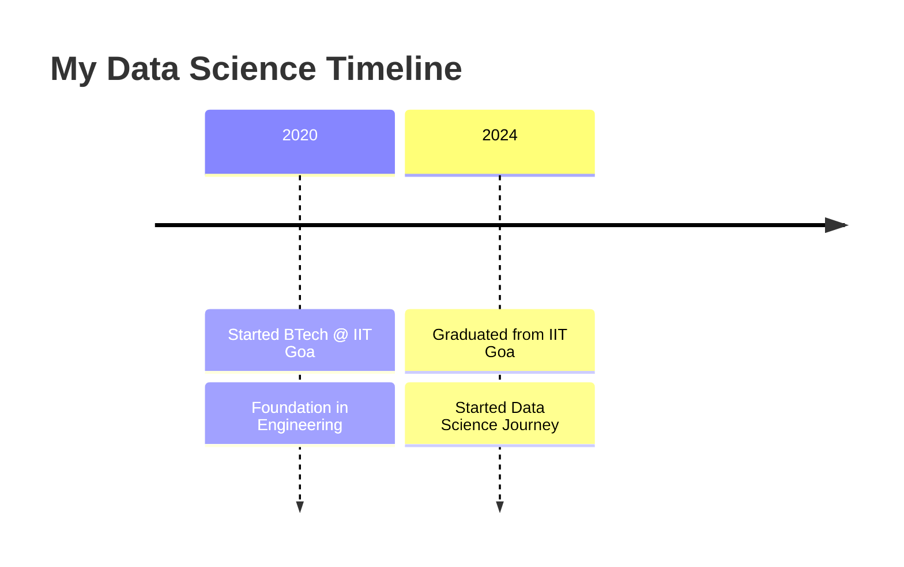

  
<!-- Dynamic Typing Animation -->

## About Me

*Data Scientist · Machine Learning Engineer · IIT Goa Graduate*

I am a data scientist with a foundation in engineering and a passion for transforming raw data into meaningful, actionable insights. Having graduated from **IIT Goa** with a degree in Mechanical Engineering, I made a deliberate transition into the world of data science — driven by the belief that the most impactful decisions of our time will be powered by data.

With hands-on experience building and benchmarking production-grade machine learning models, I bring both analytical rigor and a results-oriented mindset to every problem I tackle. My work spans end-to-end ML pipelines — from exploratory data analysis and feature engineering to model evaluation and deployment-readiness.

 

> *"I don't just build models — I build solutions that bridge the gap between data and decisions."*

---

## 🛠️ Tech Arsenal

### Languages & Core Skills

### Data Science & ML Stack

### Visualization & BI Tools

### Tools & Platforms

---

## 📊 GitHub Analytics

  
  

  

  

---

## 🚀 Featured Projects

### 🎯 Smart Travel Predictor
> **Machine Learning Model for Travel Predictions**
- 📊 Analyzed **50K+ records** with comprehensive EDA
- 🤖 Benchmarked **6+ ML algorithms** (Logistic Regression, Decision Tree, Random Forest, Gradient Boosting, XGBoost, AdaBoost)
- 🎯 Achieved **90% accuracy** with advanced feature engineering
- 📈 **ROC-AUC: 0.90+** | Cross-validation for robust predictions

### 🔮 AI Job Risk Predictor
> **Workforce Analytics & Risk Assessment**
- 👥 Processed **30K+ workforce records** across **15+ features**
- 🧠 Developed ensemble models achieving **88-92% accuracy**
- 🔧 Feature engineering improved performance by **12-15%**
- 📊 **F1-Score & ROC-AUC: 0.87-0.91** | Production-ready model

---

## 💼 Professional Journey

---

## 🎓 Education

**🏛️ Indian Institute of Technology, Goa**  
*Bachelor of Technology in Mechanical Engineering*  
**2020 - 2024**

---

## 📈 Contribution Graph

---

## 🌐 Let's Connect

 

*Open to collaborations, opportunities & conversations about data.*

 

<table>
  <tr>
    <td align="center">
      <a href="mailto:sankalpsatpute56@gmail.com">
         
        sankalpsatpute56@gmail.com
      </a>
    </td>
    <td align="center">
      <a href="https://www.linkedin.com/in/sankalp-satpute">
         
        sankalp-satpute
      </a>
    </td>
    <td align="center">
      <a href="https://github.com/code-sankalp">
         
        code-sankalp
      </a>
  </tr>
</table>

 

> *"The best way to predict the future is to create it — one model at a time."*

 

---

## 🏅 Badges & Achievements

---

**⭐️ From [Sankalp Satpute](https://github.com/code-sankalp)**

